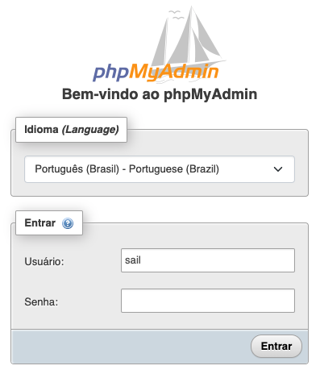

<a id='ancora'></a>
# Backend Challenge 20230105

This is a challenge by Coodesh

<br><br>

● [Sobre a Coodesh](#ancora1) <br>
● [Sobre o Desafio](#ancora2) <br>
● [Sobre o Projeto](#ancora3) <br>
● [Competências Desenvolvidas](#ancora4) <br>
● [Execução](#ancora5) <br>

<br><br>

<a id="ancora1"></a>

## Sobre a Coodesh

<br>

<p align="center">
  
</p>

<br>

A Coodesh nasceu com o propósito de ajudar outras empresas a construir os melhores e mais diversos times de tecnologia. Acreditamos que no contexto atual das startups e transformação digital de grandes empresas, recrutamento tech eficiente e com insights relevantes para evolução das pessoas contratadas é um dos maiores diferenciais para o sucesso.

<br>

<a id="ancora2"></a>

## Sobre o Desafio

<br>

Nesse desafio trabalharemos no desenvolvimento de uma REST API para utilizar os dados do projeto Open Food Facts, que é um banco de dados aberto com informação nutricional de diversos produtos alimentícios.
O projeto tem como objetivo dar suporte a equipe de nutricionistas da empresa Fitness Foods LC para que eles possam revisar de maneira rápida a informação nutricional dos alimentos que os usuários publicam pela aplicação móvel.
<br>

Nesta formação você terá uma visão geral do que é necessário para se tornar um desenvolvedor mobile no Sistema Operacional (SO) da Apple. Além disso, conteúdos mais avançados também estão disponíveis para que você conheça algumas boas práticas e padrões arquiteturais.

<br>

<a id="ancora3"></a>
## Sobre o Projeto

<br>

Para este projeto, foi utilizado o framework Laravel em conjunto com a linguagem de programação PHP. 

<p align="center"><a href="https://laravel.com" target="_blank"></a></p>

<p align="center">
<a href="https://github.com/laravel/framework/actions"></a>
<a href="https://packagist.org/packages/laravel/framework"></a>
<a href="https://packagist.org/packages/laravel/framework"></a>
<a href="https://packagist.org/packages/laravel/framework"></a>
</p>

<br>

## Requisitos Obrigatórios

<br>

### Requisito 1
Criar um banco de dados MongoDB usando Atlas: https://www.mongodb.com/cloud/atlas ou algum Banco de Dados SQL se não sentir confortável com NoSQL;
* Resultado: Para este projeto, foi escolhido o banco de dados MySQL devido à sua ampla utilização e familiaridade. Todas as configurações necessárias para a criação do banco de dados e interface com o PHPMyAdmin já estão inclusas no arquivo docker-compose.yml

<p align="center">
  
</p>

<br>

### Requisito 2
Criar uma REST API com as melhores práticas de desenvolvimento, Design Patterns, SOLID e DDD;
* Resultado: A REST API desenvolvida segue as melhores práticas de desenvolvimento, Design Patterns, SOLID e DDD. O Laravel, escolhido como framework, é conhecido por possuir uma arquitetura baseada no padrão MVC (Model-View-Controller), porém, para garantir uma melhor organização do código e separação de responsabilidades, foi adicionada uma camada extra ao projeto. Com o objetivo de implementar um modelo arquitetural DDD (Domain-Driven Design), foram criadas duas camadas adicionais na aplicação: a de Repositories e a de Services. Essas camadas foram desenvolvidas para proteger as dependências, domínios e regras de negócio do projeto, tornando-o mais escalável e fácil de ser mantido a longo prazo.

A camada de Repositories é responsável pela relação Modelo/Entidade da aplicação e pelo controle da integração com o Banco de Dados através do Eloquent. Isso possibilita a utilização de dois dos princípios SOLID: o Single Responsability Principle (cada classe do repositório tem apenas a finalidade de interagir com sua respectiva entidade) e o Open-Closed Principle (é possível integrar novas formas de consulta com o Eloquent através da interface de repositório).

A camada de Services está interligada à camada Repositories e utiliza suas interfaces para construção das regras de negócio, seguindo o Design Pattern Dependency Injection. Além disso, é responsável por comandar o Controller para integração dos Endpoints da API.

Para garantir a qualidade do código e evitar erros, também foi incorporado ao projeto o método de desenvolvimento TDD (Test Driven Development), onde todo processo de desenvolvimento segue o ciclo red-green-refactor. Isso garante que o código esteja sempre em conformidade com as especificações e reduz a ocorrência de bugs.

### Requisito 3
Integrar a API com o banco de dados criado para persistir os dados

* Resultado: Eu configurei o banco de dados MySQL no docker-compose.yml do projeto. Para criar a imagem do banco, basta executar o comando:

`````
./vendor/bin/sail up -d
`````

Para criar as tabelas do banco, execute o comando:

`````
sail artisan migrate
`````

Como mencionei anteriormente, também configurei a interface do PHPmyAdmin no Docker, que pode ser acessada facilmente pelo navegador através do link:
`````
http://localhost:8080/
`````
Para acessá-la, você pode utilizar o seguinte nome de usuário:
`````
Usuário: sail
Senha: password
`````

<br>

### Requisito 4
 Sistema de atualização automática de dados da Open Food Facts 🍎🥦🥕

* Resultado: Com esta atualização, nossa API agora possui um sistema de atualização automática de dados da Open Food Facts, garantindo que os usuários sempre tenham acesso às informações mais recentes sobre os produtos que vendemos.

Através do `CRON Task Scheduling` do Laravel, foi montado um sistema de agendamento de execuções que realiza o download dos arquivos da Open Food Facts API diariamente às 23:00 no timezone (America/Belem). O horário e timezone podem ser facilmente alterados no arquivo `app/Console/Kernel.php` para atender às necessidades da nossa empresa.

Para mais informações sobre a lista de timezones suportados pelo PHP, consulte a documentação oficial: [Documentação Timezones](https://www.php.net/manual/en/timezones.america.php)

Para testar a atualização automática, basta executar o comando `sail artisan schedule:work` e o sistema irá funcionar automaticamente.

<br>

### Requisito 5
 Implementação de CRUD e endpoints com paginação na REST API 🚀

* Resultado: Nossa REST API agora apresenta um conjunto completo de endpoints, incluindo operações CRUD, para que os usuários possam criar, ler, atualizar e excluir produtos com facilidade. Além disso, implementamos uma funcionalidade de paginação para melhorar o desempenho da API, garantindo que o REQUEST não sobrecarregue o sistema. 

Endpoints disponíveis:
- GET /: Retorna informações importantes, como detalhes da API, horário da última execução do CRON, tempo online e uso de memória.
- PUT /products/:code: Atualiza as informações de um produto existente com base no código.
- DELETE /products/:code: Altera o status do produto para "trash".
- GET /products/:code: Retorna informações sobre um produto específico com base no código.
- GET /products: Lista todos os produtos disponíveis na base de dados com paginação para melhorar o desempenho.

Aproveite para conferir nossa documentação atualizada e aprenda como utilizar essa funcionalidade em sua plenitude:
[Documentação API - Fitness Foods LC](https://fitness-foods-main-doc-api.vercel.app/)

Confira também nosso repositório de documentação para mais detalhes sobre essa atualização:
[Repositório da Documentação](https://github.com/opatrickmachado/fitness-foods-main-doc-api)

<br>

### Requisito 6 (Extra)
 Integração do Docker ao Projeto 🐳🚀

* Resultado: Agora nosso projeto conta com a integração do Docker, tornando o deploy muito mais fácil e eficiente para nossa equipe de DevOps!

Com a execução do comando `./vendor/bin/sail up -d`, nosso projeto é executado dentro de contêineres isolados e padronizados, garantindo que as dependências estejam sempre corretas e que a configuração do ambiente seja consistente em todos os sistemas. Além disso, é possível escalar facilmente nossa aplicação e serviços de back-end.

Para facilitar ainda mais o desenvolvimento, também adicionamos um alias para o comando `sail`, permitindo que a equipe possa executar nossos comandos personalizados de forma mais rápida e fácil.

<br>

### Requisito 7 (Extra)
Configurar um sistema de alerta se tem algum falho durante o Sync dos produtos;

* Resultado: Aprimoramento do sistema de importação de produtos com a adição de um sistema de alerta em caso de falhas. As falhas serão registradas no arquivo de logs do Laravel, localizado em storage/logs/laravel.log. Além disso, será possível verificar o status da última importação na tabela APIStatus do banco de dados. Com isso, garantimos uma maior confiabilidade e segurança no processo de importação de produtos.

<br>

### Requisito 8 (Extra)
Descrever a documentação da API utilizando o conceito de Open API 3.0;

* Resultado:  Aproveite para conferir nossa documentação atualizada e aprenda como utilizar essa funcionalidade em sua plenitude:
[Documentação API - Fitness Foods LC](https://fitness-foods-main-doc-api.vercel.app/)

Confira também nosso repositório de documentação para mais detalhes sobre essa atualização:
[Repositório da Documentação](https://github.com/opatrickmachado/fitness-foods-main-doc-api)

<br>

### Requisito 9 (Extra)
Escrever Unit Tests para os endpoints  GET e PUT do CRUD;

* Resultado: Para garantir a qualidade e robustez da nossa API, é crucial que realizemos testes unitários em todos os endpoints do CRUD. Nesse sentido, é recomendável que sejam criados testes para os endpoints GET e PUT, que são responsáveis por obter e atualizar dados, respectivamente.

Ao executar os testes utilizando o comando "sail artisan test", estaremos realizando testes automatizados que irão verificar se os endpoints estão funcionando corretamente e se as respostas fornecidas pela API estão de acordo com o esperado.

Além disso, é importante destacar que a execução dos testes faz parte de uma estratégia de desenvolvimento conhecida como TDD (Test Driven Development), que consiste em escrever os testes antes de implementar o código, a fim de garantir que o software está funcionando corretamente desde o início do desenvolvimento.

Por fim, ao realizarmos testes em todos os endpoints da nossa API, estaremos assegurando a qualidade do nosso produto, aumentando a confiabilidade dos nossos clientes e minimizando erros e bugs que possam surgir durante a utilização da aplicação.

<br>

### Requisito 10 (Extra)
Escrever um esquema de segurança utilizando API KEY nos endpoints.

* Resultado:  É fundamental garantir a segurança da nossa API para proteger as informações sensíveis dos nossos usuários. Por isso, implementamos proteção de API Keys via X-CSRF-TOKEN nos endpoints de POST, PUT, PATCH e DELETE.

Para gerar o token, basta acessar a rota /token e utilizar o valor gerado como chave/valor no cabeçalho Headers do seu API-Client de preferência. Isso irá garantir que apenas requisições autenticadas e autorizadas possam ser realizadas na API, aumentando a segurança e evitando acessos não autorizados.

Ao utilizar essa abordagem, estamos seguindo as boas práticas de segurança recomendadas pela indústria e garantindo que nossos usuários tenham uma experiência segura e confiável ao utilizar nossa API. Portanto, tenha em mente que a proteção das informações sensíveis dos nossos usuários é uma prioridade absoluta para nós e nos esforçamos continuamente para garantir a segurança e privacidade dos dados que manuseamos.

<a id="ancora4"></a>
## Competências Desenvolvidas

<br>

Trabalhei com as tecnologias mais avançadas do mercado para garantir a qualidade e eficiência do nosso produto. Algumas das ferramentas e frameworks que utilizamos são:

PHP: linguagem de programação amplamente utilizada no desenvolvimento web e que utilizamos como base para nossas aplicações.
Laravel: framework PHP moderno e robusto que utilizamos para desenvolver nossas aplicações web, garantindo alta performance e escalabilidade.
Composer: gerenciador de dependências para PHP que utilizamos para gerenciar bibliotecas e pacotes em nossas aplicações.
Eloquent: ORM (Object-Relational Mapping) utilizado pelo Laravel, que nos permite mapear objetos PHP para tabelas no banco de dados.
Docker: plataforma de containers que utilizamos para criar e gerenciar ambientes isolados de desenvolvimento e produção, garantindo maior portabilidade e segurança.
PHPUnit: framework de testes unitários para PHP que utilizamos para garantir a qualidade do nosso código e prevenir bugs e erros.
MySQL: sistema gerenciador de banco de dados relacional que utilizamos para armazenar e gerenciar dados em nossas aplicações.
RestAPI: arquitetura de software que utilizamos para construir nossas APIs, garantindo maior flexibilidade e escalabilidade.
Clean Code: conjunto de práticas e técnicas que utilizamos para escrever código legível, reutilizável e fácil de manter.
SOLID: conjunto de princípios de design de software que utilizamos para criar sistemas mais flexíveis, escaláveis e fáceis de manter.
DDD: abordagem de desenvolvimento de software que utilizamos para criar aplicações altamente escaláveis e que atendam às necessidades dos nossos usuários.
TDD: prática de desenvolvimento de software que utilizamos para garantir a qualidade do nosso código desde o início do desenvolvimento, através da criação de testes automatizados antes da implementação do código.
<br>

<br>

<a id="ancora5"></a>
## Execução 

<br>

1. Comece clonando este repositório remoto em seu equipamento usando o comando abaixo:
```
git clone https://github.com/opatrickmachado/Backend-Challenge-20230105.git
```

2. Em seguida, acesse a pasta do projeto usando o seguinte comando:
````
cd backend-challenge-20230105
````

3. Abra seu editor de código preferido (recomendo o VSCode) e abra a pasta do projeto nele:
````
code .
````

4. Renomeie o arquivo `.env.example` para `.env` e introduza suas variáveis de ambiente;

5. Para instalar as dependências do Composer, utilize o seguinte comando:
````
composer install
````

6. Agora, você pode inicializar os containers do Docker para seu ambiente de desenvolvimento usando o seguinte comando:
````
./vendor/bin/sail up -d
````

7. Para simplificar o uso do Docker, recomendamos criar um alias para o comando "sail". Você pode fazer isso usando o seguinte comando:
`````
alias sail="bash ./vendor/bin/sail"
`````

8. Crie uma chave de API usando o Docker, que será adicionada automaticamente ao arquivo .env, executando o seguinte comando:
````
sail artisan key:generate
````

9. Agora você pode utilizar todos os comandos mencionados anteriormente do Docker. Parabéns, você está pronto para começar a trabalhar neste desafio de Backend!


[Voltar ao Topo](#ancora)
